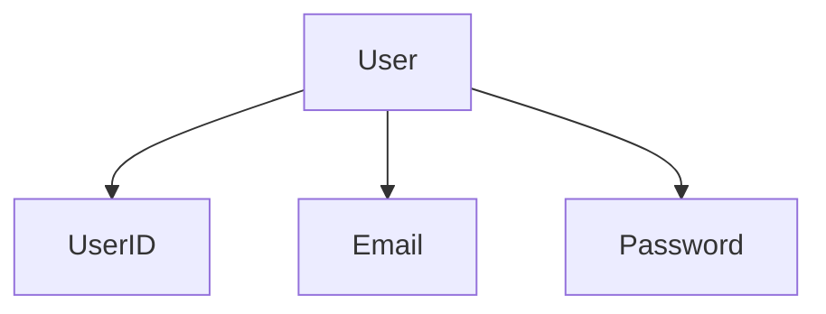
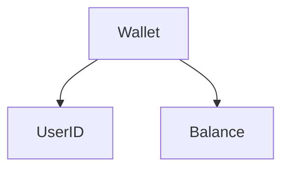

# Money Transfer Systems

Practice NestJS + CQRS + Clean Architecture + Domain Driven Design with money transfer systems

## Business

- User can transfer money in wallet to another wallet's user
- User can request money from another wallet's user by userID

### Diagram

### Aggregate Root

User

Wallet

### Behavior Development

Story : Transfer

As a user,
I want to transfer money to another user,
So that I can transfer money to them

Scenario: transfer success

Given 100 baht in my wallet
When I transfer 50 baht to wallet B
Then my wallet balance should equal 50
and send 50 baht to wallet B
